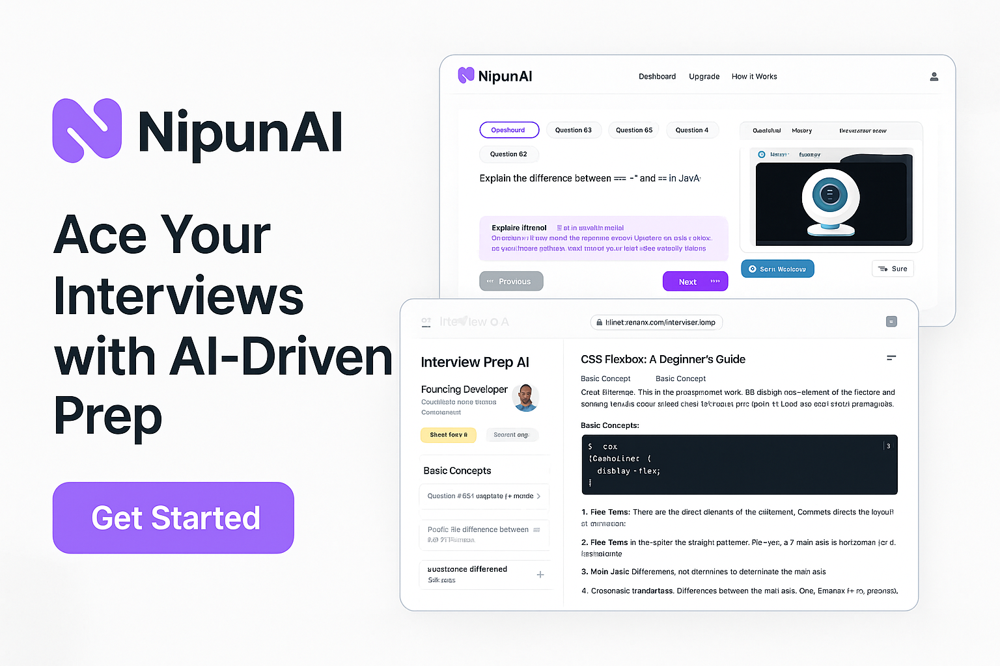

# 🚀 NipunAI


Welcome to **NipunAI** — your smart AI buddy to help you *crush* your job interviews! 🎯

---

## 💡 What is NipunAI?

NipunAI is a cool AI-powered platform that helps you practice mock interviews tailored exactly for the job you want.  
It gives you instant feedback, tips to improve, and tracks your progress — so you can feel confident and ready when the big day comes! 💪✨

---

## 🌟 Key Features

- 🎯 **Mock Interviews Just for You**  
  Get interview questions customized for your dream role.

- 📝 **Instant AI Feedback**  
  After each practice, receive smart advice on how to improve.

- 📈 **Track Your Progress**  
  See how you’re getting better over time.

- 🎨 **Beautiful & Smooth UI**  
  Built with React, Next.js, and Tailwind CSS — everything feels snappy and modern.

- 🌙 **Dark Mode Supported**  
  Use it day or night, your eyes will thank you!

- ✨ **Cool Animations**  
  Enjoy smooth fading text and a moving border effect that makes the app feel alive.

---

## 🛠️ Tech Stack

- **Frontend:** Next.js + React + Tailwind CSS + Framer Motion (for animations)  
- **Backend:** (Add your backend here if applicable)  
- **Hosting:** (Your preferred platform, e.g., Vercel)

---

## ⚡ How to Run Locally

1. Clone this repo:

   ```bash
   git clone https://github.com/Piyushraj456/NipunAI.git
   cd NipunAI
